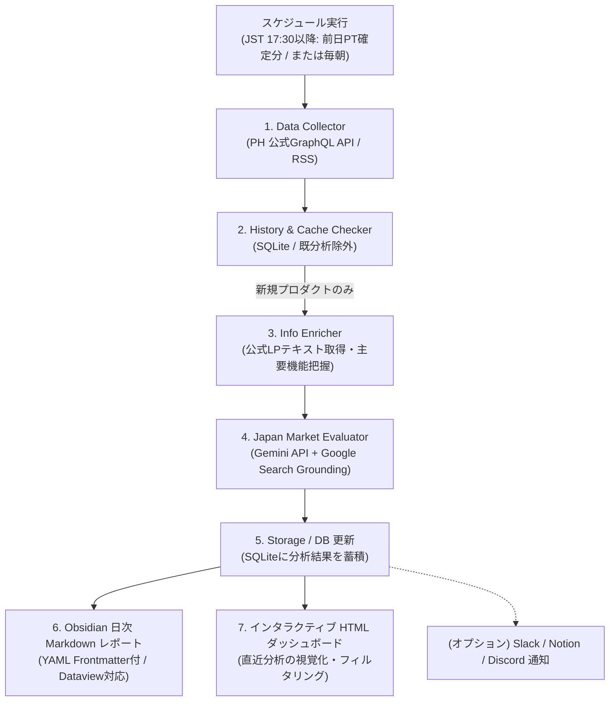

# Product Hunt 日次収集＆日本市場ローカライズ事業判定システム

Product Huntから毎日人気プロダクト（Daily Top）を自動収集し、LLM（Gemini等）を用いて**「日本で置き換えたビジネス（タイムマシン経営・日本版ローカライズSaaS/サービス）が成立するか」**を多角的に分析・スコアリングして日次レポートを出力する仕組みを構築します。

---

## 1. システム概要 & アーキテクチャ



### アーキテクチャの改善ポイント
1. **履歴管理・重複防止 (History Checker)**:
   - 過去に分析済みのプロダクト（IDまたはURLで照合）をスキップし、新規ランクインしたもののみをLLMに送信してAPIコストと実行時間を最適化。
2. **公式LP（Landing Page）のテキスト取得 (Info Enricher)**:
   - Product Huntの短文紹介だけでなく、プロダクト公式URLから見出しや価格、特徴テキストを軽量抽出（Jina Reader API等）してLLMに渡し、解像度の高い分析を実現。
3. **Web検索連携による競合調査 (Google Search Grounding)**:
   - 日本国内の既存競合・類似SaaSをGeminiの検索連携（または検索API）でリアルタイム調査し、「日本に競合がいないと誤認する」ハルシネーションを防止。
4. **タイムゾーン（時差）の明確化**:
   - Product Huntは太平洋時間（PT: 0:00〜23:59）基準。日本時間の夕方16:00〜17:00頃がPHの1日締め切りとなるため、**「日本時間 17:30（前日確定分）」**または**「毎朝（確定した前日分）」**の定時取得を行う。

---

## 2. タイムマシン事業評価フレームワーク（AI分析観点）

各プロダクトに対し、LLM（Gemini）に以下の評価軸でプロンプトを与え、構造化JSONで評価を出力させます。

| 評価項目 | 分析内容 | データ形式 |
| :--- | :--- | :--- |
| **プロダクト概要** | 誰のどんな課題をどう解決しているか（コアバリュー、収益モデル） | テキスト (要約) |
| **日本市場のニーズ・ペイン** | 日本国内でも同様の課題・不満が存在するか（市場規模・ターゲット層） | テキスト |
| **日本の既存競合** | 国内の類似・同等サービス、代替ツールの普及状況（Web検索で裏付け） | リスト / テキスト |
| **参入障壁・法規制・商習慣** | 日本特有の法規制、商慣習、セキュリティ要件、言語・文化の壁 | テキスト |
| **日本版へのアレンジ案** | 日本向けに最適化する場合のターゲット、機能調整、ポジショニング提案 | テキスト (具体案) |
| **ビジネス成立度スコア** | **S (即参入検討)** / **A (有望・要アレンジ)** / **B (ニッチ/要検証)** / **C (不適)** | ランク (S/A/B/C) + 評点 (0-100) |
| **Obsidianメタデータ** | タグ、カテゴリ、対象市場（B2B/B2C）、推定ARR/客単価帯 | YAML Frontmatter項目 |

---

## 3. ディレクトリ構成

Obsidian保管庫内にスクリプト、データ、レポートを一元配置し、管理・閲覧をスムーズに行える構成にします。

```
13_ProductHunt分析/
├── 00_システム設計・実装計画.md      # 本ドキュメント
├── config.py                       # 設定・パス・環境変数管理
├── requirements.txt                # 依存ライブラリ (google-genai, requests, pydantic, jinja2等)
├── .env.example                    # 環境変数サンプル (GEMINI_API_KEY, PH_API_TOKEN等)
│
├── src/
│   ├── __init__.py
│   ├── collectors/                 # Product Hunt データ収集
│   │   ├── __init__.py
│   │   ├── base.py
│   │   ├── ph_api.py               # 公式 GraphQL API クライアント
│   │   └── ph_rss.py               # 公式 RSS フィード取得（フォールバック用）
│   ├── enrichers/                  # LP/公式サイト情報補完
│   │   ├── __init__.py
│   │   └── lp_scraper.py           # 公式サイトテキスト抽出 (Jina Reader / requests)
│   ├── evaluators/                 # 日本市場分析
│   │   ├── __init__.py
│   │   ├── schemas.py              # Pydantic 構造化出力スキーマ
│   │   ├── prompts.py              # 日本市場ローカライズ評価プロンプト
│   │   └── analyzer.py             # Gemini連携 (Google Search Grounding対応)
│   ├── storage/                    # 履歴・重複管理
│   │   ├── __init__.py
│   │   └── db.py                   # SQLite3によるプロダクト＆評価履歴キャッシュ
│   ├── reporters/                  # レポート生成
│   │   ├── __init__.py
│   │   ├── markdown_reporter.py    # Obsidian用 Markdown レポート出力 (Frontmatter付)
│   │   └── html_reporter.py        # インタラクティブ HTML ダッシュボード更新
│   └── pipeline.py                 # 日次実行パイプラインオーケストレーター
│
├── data/
│   └── history.db                  # 分析済みプロダクト・評価のローカルDB (SQLite)
├── templates/
│   ├── report_template.md          # Obsidian Markdown テンプレート
│   └── dashboard_template.html     # HTML ダッシュボード テンプレート
├── reports/                        # 生成された日次 Markdown レポート格納先
│   └── 2026-09-21_ProductHunt日次分析レポート.md
├── dashboard.html                  # 最新のHTMLダッシュボード（ブラウザ閲覧用）
└── run_daily.py                    # 実行エントリポイント
```

---

## 4. Obsidian連携と出力フォーマット設計

生成される日次レポートは、Obsidianの検索性および **Dataviewプラグイン** との親和性を最大化するため、YAML Frontmatterを先頭に付与します。

### 日次レポートのFrontmatter例
```yaml
---
type: ph-daily-report
date: 2026-09-21
total_analyzed: 12
s_rank_count: 1
a_rank_count: 3
b_rank_count: 1
c_rank_count: 1
tags:
  - producthunt
  - timemachine-business
  - market-analysis
---
```

### プロダクトセクション / 単体ノート用Frontmatter例
```yaml
---
product_id: ph_12345
product_name: Lead Sparker
rank: S
score: 92
target: B2B 法人営業
ph_url: https://www.producthunt.com/posts/lead-sparker
official_url: https://leadsparker.com
analyzed_at: 2026-09-21
---
```

---

## 5. ユーザー確認事項 (User Review Required)

> [!IMPORTANT]
> **APIキーと実行環境**
> 1. **Gemini API**:
>    - 日本の競合Web検索および構造化分析のため、`GEMINI_API_KEY` を利用します。Gemini 2.5 Flash は高速かつSearch Grounding（検索連携）に対応しており、最適な選定です。
> 2. **Product Hunt API**:
>    - 公式APIトークンがある場合は高精度な日次ランキング（Upvote数、Makerコメント等）が取得可能です。
>    - トークンが未取得でも、公式RSSフィード（`/feed`）から即座に動作するハイブリッド設計となっています。
> 3. **実行スケジュール**:
>    - 手動実行: `python run_daily.py`
>    - 自動化: Windowsタスクスケジューラ（またはGitHub Actions）にて、毎夕17:30または毎朝定時にバックグラウンド起動を設定可能。

---

## 6. 検証手順 (Verification Plan)

### 自動/単体テスト
- Product Hunt コレクターの取得テスト（RSS / API / モック）
- SQLite 履歴DBの重複スキップ動作確認
- LPテキスト取得機能（Jina Reader / requests）の疎通確認
- Gemini EvaluatorのPydanticバリデーション＆検索Groundingの動作確認

### 実機検証
- `python run_daily.py --mock` (APIキー消費なしでパイプライン全行程の動作確認)
- `python run_daily.py --limit 3` (3件のみ実データで取得・Gemini分析を行い、MarkdownとHTMLダッシュボードが生成されるか確認)
- 生成されたレポートがObsidian上で美しくレンダリングされ、HTMLダッシュボードがブラウザで正常に閲覧できることを確認
