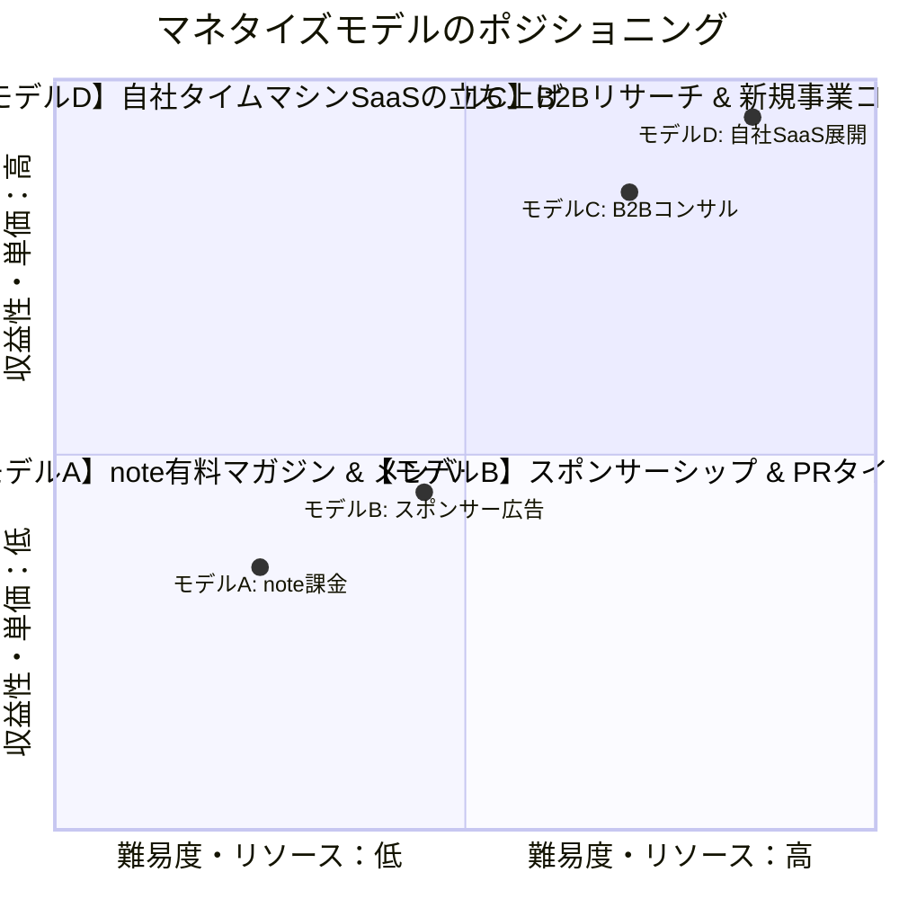
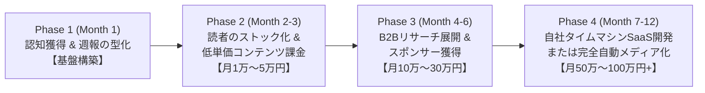

# 🗺️ Global Tech Radar マネタイズ・ロードマップ

> **ビジョン**: 海外の最新Tech/AIプロダクトの自動分析基盤を核に、**「認知（SNS） → ストック（メディア） → 収益化（課金・B2B・自社事業）」** の多層ファネルを構築する。

---

## 1. 収益化モデルの全体像（4つのマネタイズエンジン）

本システムから生み出せる収益モデルは、単価・難易度・手間のバランスに応じて以下の4種類が存在します。初期は**モデルA（低単価・高再現性）**から着手し、並行して**モデルC・D（高単価・高リターン）**へとスケールさせます。

| モデル | 収益手法 | 想定単価 | 対象顧客 | 特徴 |
| :--- | :--- | :--- | :--- | :--- |
| **モデルA: コンテンツ課金** | note有料マガジン / メンバーシップ / 単品note | 月額 500〜980円 / 単品 500〜1,500円 | 個人開発者、スタートアップ志望者、AI動向を追うビジネスパーソン | 自動化された週報・月報をベースにするため、労力最小で継続課金を生む |
| **モデルB: スポンサー広告** | ニュースレター・note内のPR枠、Threads紹介 | 1記事・1枠あたり 3万〜10万円 | 国内のAIスタートアップ、B2B SaaS企業 | フォロワー数（読者リスト数）の成長に伴いインバウンドで獲得可能 |
| **モデルC: B2Bリサーチ支援** | 企業向け海外競合リサーチ / 新規事業企画支援 | 月額 10万〜30万円 / 件 | 国内IT企業、新規事業開発室、VC/CVC | 蓄積されたDBと分析レポートを活用し、高単価な受託・コンサルへ発展 |
| **モデルD: タイムマシン事業化** | Sランク案件の日本版MVP自社開発 | ARR 数百万円〜数千万円 | 国内法人（B2B）または特定バーティカル市場 | 最もアップサイドが大きい。自社メディアがそのまま「初期顧客の集客装置」になる |

---

## 2. フェーズ別ロードマップ（Month 1 〜 Month 12）

---

### 📍 Phase 1: 認知獲得 & 週報の型化（Month 1 / 現在〜1ヶ月目）

* **主目的**: Threadsでの露出最大化 ＋ 週末のnote週報の定期配信リズムを確立する。
* **主要アクション**:
  1. **Threads運用の継続**:
     * 毎朝06:35の「画像添付＋2段階ツリー投稿」を完全自動で回し、インプレッションを獲得。
  2. **note週報の無料配信（週1回）**:
     * `run_weekly.py` の生成ロジックを強化し、毎週土曜（または日曜朝）に「今週の海外AI・SaaSトレンド10選＆日本でのビジネスチャンス」を公開。
  3. **導線設計の整備**:
     * Threadsプロフィールに「週末に1週間のまとめをnoteで配信中（リンク）」を設置。
     * note記事の文末に「毎朝の速報はThreads（[@get_globaltechinfo](https://www.threads.net/@get_globaltechinfo)）で配信中」と相互送客。
* **KPI**:
  * Threadsフォロワー: 300〜500人
  * noteフォロワー: 50〜100人 / 各週報の「スキ」10〜20件

---

### 📍 Phase 2: 読者のストック化 & 初期のコンテンツ課金（Month 2〜3）

* **主目的**: リピート読者を固定化し、最初の「1円」を稼ぐ（課金検証）。
* **主要アクション**:
  1. **noteメンバーシップ / 有料マガジンの開設**:
     * 無料部分: 「今週のトレンド概要＋Top 5」
     * 有料部分（月額500〜980円）: 「Sランク案件の徹底解剖（日本版機能要件・想定ARR試算・推奨参入戦略）」＋「全案件ダッシュボードのアクセス権（パスワード共有）」
     * 💡 **【今後の拡張構想】メンバーシップのランク別アクセス制御**:
       * **スタンダード会員（月額500円）**: A/Bランクの全件検索＋週報閲覧
       * **プロ・事業開発会員（月額1,500〜2,980円）**: 最上位Sランクの全件深掘り・MVP仕様書＋全案件DBの完全アンロック（合言葉・ランク別認証により閲覧制限を制御）
  2. **キラーコンテンツの単品販売（500〜1,500円）**:
     * 例: 『【月刊完全版】海外でローンチされた最先端AIプロダクト50選と、日本で再現できるタイムマシン事業アイデア集』
  3. **読者コミュニティ・コメント欄の活性化**:
     * 「このツールの日本版、どう思いますか？」など議論を生み、定着率を高める。
* **KPI / 収益目標**:
  * Threadsフォロワー: 1,000〜2,000人
  * 有料会員（メンバーシップ）: 20〜50人
  * **月次売上: 1万〜5万円**

---

### 📍 Phase 3: B2B展開 & スポンサー獲得（Month 4〜6）

* **主目的**: 高単価（月数十万円）のマネタイズチャネルを立ち上げる。
* **主要アクション**:
  1. **B2B相談窓口の設置**:
     * noteの末尾やプロフィールに「新規事業リサーチ・海外競合調査のご相談はこちら（問い合わせフォーム）」を設置。
     * 大企業新規事業部、スタートアップ経営陣、VC向けに「特定業界の海外テックカスタム定点観測」を提案（月額15万〜30万円）。
  2. **スポンサー枠・タイアップPRの受付**:
     * 読者層（IT感度の高い層）に向け、国内AI企業やSaaSツールのPR記事・バナー枠を販売（1回3万〜5万円）。
  3. **X（Twitter）への配信拡大**:
     * Threadsでウケた投稿をXにも自動・半自動で横展開し、B2B意思決定層（経営者・事業開発者）の流入を加速。
* **KPI / 収益目標**:
  * ニュースレター/note読者: 500〜1,000人
  * B2Bリサーチ契約: 1〜2社
  * **月次売上: 15万〜35万円**

---

### 📍 Phase 4: 自社タイムマシンSaaS開発 or メディア資産化（Month 7〜12）

* **主目的**: 蓄積した知見と集客力を活かした「自社事業の立ち上げ」または「不労所得メディア化」。
* **主要アクション（選択肢）**:
  * **ルートA（自社SaaS立ち上げ）**:
    * 過去半年で分析した数百件の中から「日本市場で明らかに空席があり、需要が高いSランク案件」を厳選。
    * 日本向けローカライズMVP（NoCode/AI活用で1〜2ヶ月で構築）を開発。
    * **自身が運営するメディア（Threads/note）をそのまま初期ユーザーの獲得チャネルとして活用**。
  * **ルートB（完全自走メディア）**:
    * コンテンツ課金＋スポンサーシップで月20万〜50万円を安定化させ、自身は最低限のメンテナンスのみで回す。
* **KPI / 収益目標**:
  * **月次売上: 50万〜100万円以上**

---

## 3. 次の具体的一歩（今週着手すべきこと）

このロードマップを動かすために、今週やるべき最も重要な一手は**「Phase 1の週報生成パイプライン（note用リッチ原稿の自動出力）」**の構築です。

1. **`run_weekly.py` のnoteフォーマット化**:
   * 平日（月〜金）に蓄積された分析データから、S/Aランクを厳選。
   * noteのエディタにそのまま貼り付けられる「見出し（H2/H3）」「導入フック」「今週の総括」「アイキャッチ画像URL」を完全自動整形。
2. **週末の第1回無料公開**:
   * 最初のnote記事を無料公開し、Threadsからもリンクを貼って読者の反応をテスト。
